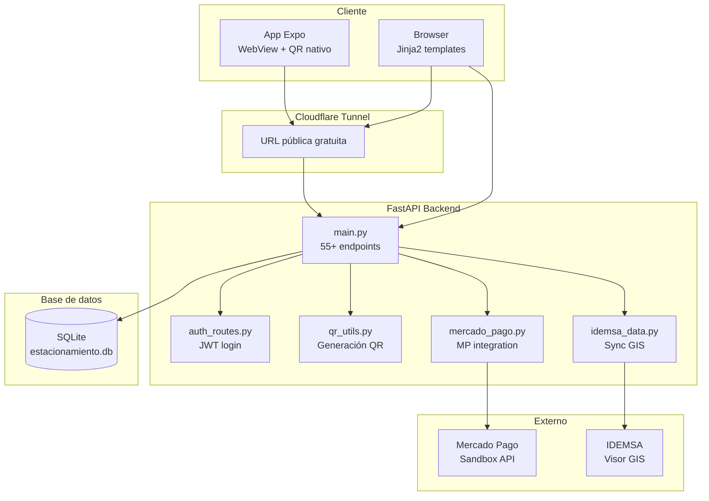
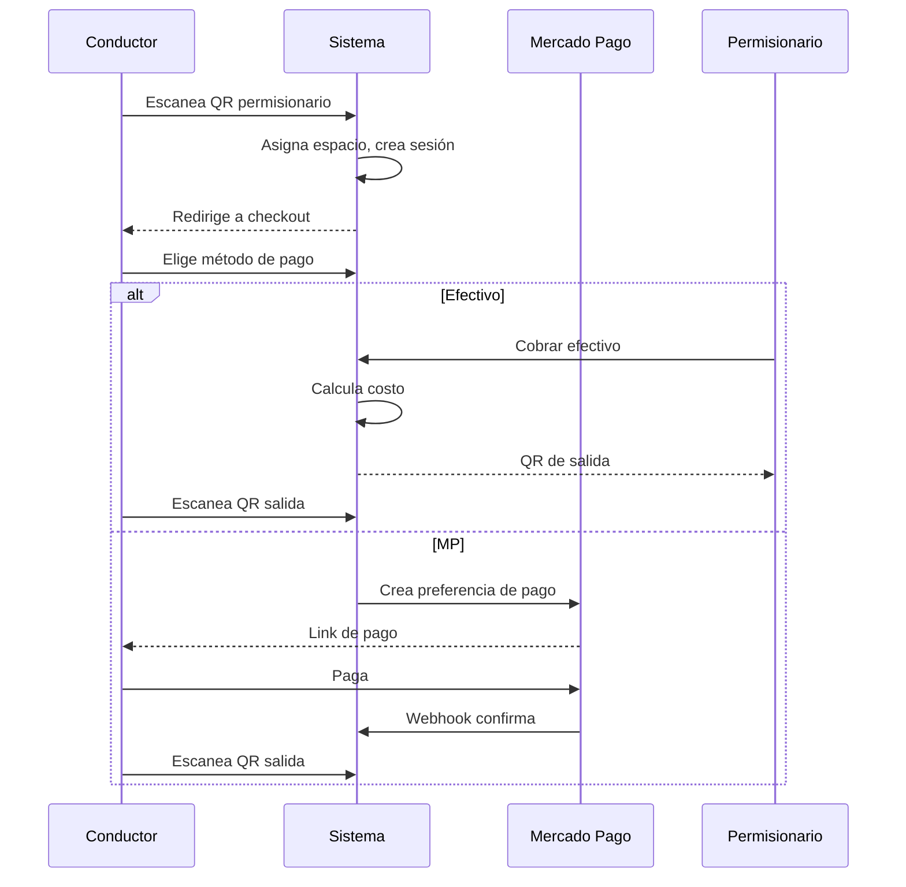
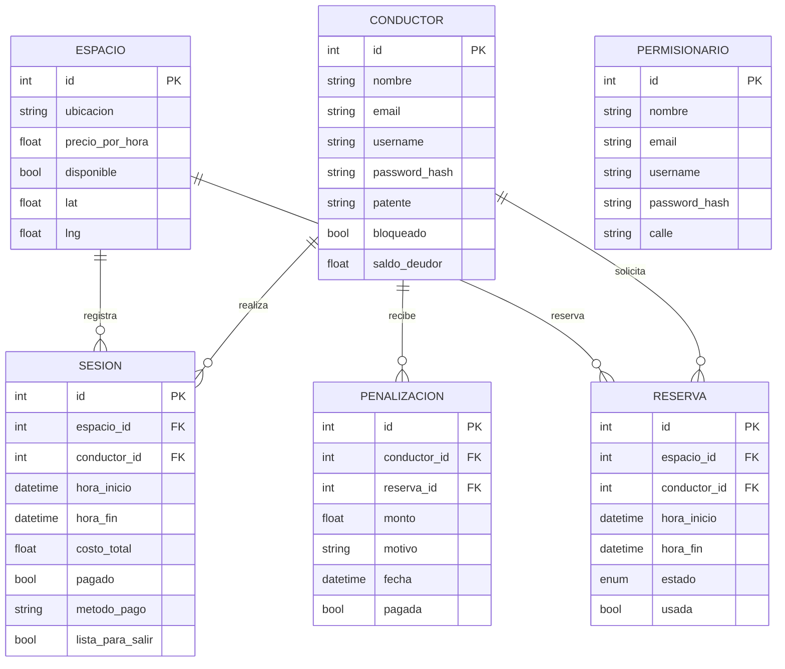

# 🅿️ Estacionamiento Medido — Salta

Sistema completo de estacionamiento medido inteligente con 3 roles (conductor, permisionario, admin), geolocalización con datos oficiales de IDEMSA, pagos con Mercado Pago, reservas, penalizaciones por no-show, y app mobile wrapper en Expo.

> **Demo sin presupuesto:** sin hosting, sin dominios, sin servicios pagos.
> Usa Cloudflare Tunnel gratuito para exponer localhost.

---

## Stack

| Capa | Tecnología |
|------|-----------|
| Backend | Python 3.12 + FastAPI + SQLAlchemy (async) |
| Base de datos | SQLite (aiosqlite) |
| Autenticación | JWT (python-jose) + bcrypt |
| Frontend | Jinja2 templates + CSS vanilla |
| Mapas | Leaflet + OSM tiles + MarkerCluster |
| QR | jsQR (web) + expo-camera (nativo) |
| Pagos | Mercado Pago API (sandbox) |
| Mobile | Expo (React Native) + WebView |
| Túneles | Cloudflare Tunnel |

---

## Inicio rápido

```bash
git clone https://github.com/gildoadiaz-tech/estacionamiento-medido.git
cd estacionamiento-medido
python3 -m venv venv
source venv/bin/activate
pip install -r requirements.txt
python seed.py
uvicorn app.main:app --reload --host 0.0.0.0 --port 8000
```

Abrir **http://localhost:8000**

### Exponer con Cloudflare Tunnel (para probar desde el celular)

```bash
cloudflared tunnel --url http://localhost:8000
# Genera: https://<random>.trycloudflare.com
```

---

## Usuarios de prueba

| Usuario | Contraseña | Rol | Datos |
|---------|-----------|-----|-------|
| `pedro` | `1234` | Conductor | Patente AB123CD |
| `ana` | `1234` | Conductor | Patente BC456EF |
| `juan` | `1234` | Permisionario | Calle: Gral. Güemes |
| `maria` | `1234` | Permisionario | Calle: Caseros |
| `admin` | `admin123` | Admin | — |

---

## Arquitectura



### Flujo de check-in / check-out



### Modelo de datos



---

## Roles y flujos

### 👤 Conductor (Uber-style, fondo negro forzado)

1. **Login** → JWT guardado en localStorage
2. **Home** → sesión activa con timer (cuenta hacia arriba), checkout inmediato
3. **Escanear QR** → cámara nativa o web (jsQR) detecta:
   - QR de permisionario (`/conductor/checkin/perm/{id}`) → check-in automático
   - QR de salida (`/conductor/checkout/{sesion_id}`) → finaliza sesión
4. **Checkout** → elige método de pago (efectivo / Mercado Pago), confirma
5. **Mapa** → Leaflet con capas: medido (verde), prohibido (rojo), libre (azul)
6. **Perfil** → editar patente, ver historial
7. **Reservas** → solicitar, ver estado, historial

### 🅿️ Permisionario (dueño de una cuadra)

1. **Login** → ve su panel con estadísticas
2. **Sesiones activas** → tarjetas con patente + timer en tiempo real + botón "Cobrar"
3. **Cobrar efectivo** → calcula costo, genera QR de salida (modal)
4. **Reservas pendientes** → aprobar / rechazar
5. **QR propio** → muestra QR de su cuadra para que conductores escaneen
6. **Ganancias** → gráfico Chart.js semanal (solo pagadas), CSV exportable
7. **Mapa** → espacios de su cuadra

### 🔧 Admin

1. **Dashboard** → stats generales
2. **CRUD** → permisionarios, conductores, espacios
3. **Sesiones** → todas las sesiones activas e históricas
4. **Reservas** → listado completo
5. **Reportes** → ingresos, ocupación
6. **Penalizaciones** → listado, stats, condonar, desbloquear conductores
7. **Verificar no-show** → botón manual para ejecutar penalizaciones

---

## Reglas de negocio

### Precio
- **$600/h fijo** — tarifa plana única para todos los espacios
- Solo se cobra en **horario operativo**:
  - Lun–Vie: 7:00 a 21:00
  - Sáb: 7:00 a 14:00
  - Domingos y feriados: **gratis**
- Si el auto pasa la noche, el costo **se reinicia a las 7:00** del día siguiente
- El costo se calcula **al salir**, no al entrar

### Penalizaciones
- **No-show**: reserva aprobada no usada → penalización del 10% de $600 = **$60**
- **Check-in tardío**: >5 min de tolerancia → penalización del 10%
- Máximo **5 penalizaciones por mes** → bloqueo automático
- **Deuda > $10,000** → bloqueo automático
- Desbloqueo: pagar **$5,000** (POST `/api/conductores/{id}/pagar-multa`)
- Tarea background cada 60s penaliza reservas vencidas no usadas

### Reservas
- Conductor solicita → permisionario aprueba/rechaza
- Check-in dentro de la ventana de reserva (con 5 min de tolerancia)
- Si no se usa antes de `hora_fin`, se penaliza como no-show

### Pagos
- **Efectivo**: permisionario presiona "Cobrar" → calcula costo → muestra QR de salida → conductor escanea → finaliza
- **Mercado Pago**: checkout → redirige a MP → webhook confirma → `lista_para_salir=True` → conductor escanea QR de salida

---

## API — Endpoints principales

### Autenticación
| Método | Ruta | Descripción |
|--------|------|-------------|
| POST | `/api/auth/login` | Login, devuelve JWT + rol + user_id |
| GET | `/api/auth/me` | Verificar token actual |

### Conductores
| Método | Ruta | Descripción |
|--------|------|-------------|
| GET | `/api/conductores/{id}` | Obtener conductor |
| PUT | `/api/conductores/{id}` | Actualizar (patente, nombre, etc.) |
| POST | `/api/conductores` | Crear conductor |
| GET | `/api/conductores/{id}/status` | Estado (bloqueado, deuda, penalizaciones) |
| GET | `/api/conductores/{id}/penalizaciones` | Historial de penalizaciones |
| POST | `/api/conductores/{id}/pagar-multa` | Pagar multa de desbloqueo ($5,000) |

### Sesiones (check-in / check-out)
| Método | Ruta | Descripción |
|--------|------|-------------|
| POST | `/api/checkin` | Check-in por espacio_id |
| POST | `/api/checkin-por-perm` | Check-in escaneando QR de permisionario |
| POST | `/api/sesion/{id}/elegir-pago` | Elegir método de pago y patente |
| POST | `/api/sesion/{id}/confirmar-pago-efectivo` | Confirmar pago en efectivo (calcula costo) |
| GET | `/api/sesion/{id}/exit-qr` | Obtener QR de salida |
| POST | `/api/sesion/{id}/finalizar-por-scan` | Finalizar sesión escaneando QR de salida |
| GET | `/api/checkin-qr/{sesion_id}` | QR de check-in |
| POST | `/api/checkout` | Check-out tradicional |
| GET | `/api/sesiones` | Todas las sesiones |
| GET | `/api/sesiones/activas` | Sesiones activas |
| GET | `/api/sesiones/conductor/{id}` | Sesiones de un conductor |
| GET | `/api/sesiones/activas/{perm_id}` | Sesiones activas de un permisionario |
| GET | `/api/sesiones/activa/{conductor_id}` | Sesión activa actual de un conductor |
| GET | `/api/sesiones/ingresos/{perm_id}` | Ingresos (solo pagadas) |
| GET | `/api/sesiones/permisionario/{id}/detalle` | Detalle con ubicación |

### Mercado Pago
| Método | Ruta | Descripción |
|--------|------|-------------|
| POST | `/api/mercadopago/webhook` | Webhook de confirmación de pago |

### Espacios
| Método | Ruta | Descripción |
|--------|------|-------------|
| GET | `/api/espacios` | Todos los espacios |
| GET | `/api/espacios/disponibles` | Espacios disponibles |
| GET | `/api/espacios/con-estado` | Espacios con estado (libre/ocupado) |
| GET | `/api/espacio/by-location` | Buscar por ubicación |
| POST | `/api/espacios` | Crear espacio |

### Reservas
| Método | Ruta | Descripción |
|--------|------|-------------|
| GET | `/api/reservas` | Todas las reservas |
| GET | `/api/reservas/conductor/{id}` | Reservas de un conductor |
| GET | `/api/reservas/permisionario/{id}` | Reservas de un permisionario |
| GET | `/api/reservas/pendientes/{perm_id}` | Pendientes de aprobación |
| POST | `/api/reservas` | Crear solicitud |
| POST | `/api/reservas/aprobar` | Aprobar/rechazar |

### Permisionarios
| Método | Ruta | Descripción |
|--------|------|-------------|
| GET | `/api/permisionarios` | Listar todos |
| POST | `/api/permisionarios` | Crear |

### Admin
| Método | Ruta | Descripción |
|--------|------|-------------|
| GET | `/api/admin/penalizaciones` | Todas las penalizaciones |
| GET | `/api/admin/penalizaciones/stats` | Estadísticas |
| POST | `/api/admin/penalizaciones/{id}/waiver` | Condonar penalización |
| GET | `/api/admin/conductores/bloqueados` | Conductores bloqueados |
| POST | `/api/admin/conductores/{id}/desbloquear` | Desbloquear |
| POST | `/api/admin/verificar-no-show` | Ejecutar verificación manual |

### Mapas
| Método | Ruta | Descripción |
|--------|------|-------------|
| GET | `/api/mapa/cercanos` | Espacios cercanos (radio 300m) |
| GET | `/api/mapa/idemsa-calles` | Calles desde IDEMSA (para mostrar en mapa) |

---

## Datos geoespaciales (IDEMSA)

El sistema sincroniza **6,974 espacios** generados a partir de **604 segmentos viales oficiales** extraídos del visor GIS de IDEMSA Municipalidad de Salta:

- `idemsa_data.py` → descarga/parsea archivos JS públicos de IDEMSA
- `sync_espacios_db()` → genera puntos grid cada ~7m, los persiste en SQLite
- 3 categorías en el mapa: estacionamiento_medido (verde), prohibido (rojo), libre (azul)
- Permisionarios son dueños de **calles enteras** (no espacios individuales): se matchean por `ubicacion.startswith(perm.calle)`
- Mapa offline: Calles del centro definidas manualmente en `mapa_data.py` (18 calles)

---

## Mobile App (Expo)

```
mobile-app/
├── App.js                    # Stack navigator (Home, QRScanner, Config)
├── app.json                  # Expo config (dark UI, camera permissions)
├── context/
│   └── ServerUrlContext.js    # Server URL persistence (AsyncStorage)
├── screens/
│   ├── WebViewScreen.js       # Full-screen WebView + floating QR & gear
│   ├── QRScannerScreen.js     # Native QR scanner (expo-camera)
│   └── ConfigScreen.js        # Server URL input
└── assets/                    # Placeholder icons
```

### Correr la app mobile

```bash
cd mobile-app
npm install
npx expo start
```

Escaneá el QR con Expo Go en tu celular, o presioná `a` para Android emulator / `i` para iOS simulator.

Configurá la URL del servidor (localhost o Cloudflare Tunnel) desde el ícono de engranaje ⚙️.

---

## Estructura del proyecto

```
estacionamiento/
├── app/
│   ├── main.py              # 1297 líneas — rutas API + HTML
│   ├── models.py            # SQLAlchemy models (7 tablas)
│   ├── schemas.py           # Pydantic schemas
│   ├── database.py          # Conexión async SQLite
│   ├── auth.py              # JWT + bcrypt
│   ├── auth_routes.py       # Login endpoint
│   ├── deps.py              # Dependencias (get_current_user)
│   ├── qr_utils.py          # Generación de QR (PIL)
│   ├── mercado_pago.py      # Integración MP sandbox
│   ├── mapa_data.py         # Calles del centro (Leaflet)
│   ├── idemsa_data.py       # Sincronización IDEMSA (604 segmentos)
│   ├── static/              # Archivos estáticos (JS, CSS, imágenes)
│   └── templates/           # Jinja2 templates
│       ├── conductor/       # 9 vistas (checkin, checkout, mapa, perfil...)
│       ├── permisionario/   # 5 vistas (panel, reservas, qr, mapa)
│       ├── admin/           # 8 vistas (dashboard, penalizaciones, reportes)
│       └── auth/            # Login
├── mobile-app/              # Expo React Native wrapper
├── docs/                    # Documentación adicional
├── seed.py                  # Datos de prueba
├── requirements.txt
└── README.md
```

---

## Configuración

### Variables de entorno

| Variable | Default | Descripción |
|----------|---------|-------------|
| `JWT_SECRET` | `estacionamiento-salta-secret-key-2024` | Secreto para firmar tokens JWT |
| `MP_ACCESS_TOKEN` | `TEST-...` | Token de acceso de Mercado Pago Sandbox |

### Constantes del sistema (en `main.py`)

| Constante | Valor | Descripción |
|-----------|-------|-------------|
| `PRECIO_POR_HORA` | 600.0 | Tarifa por hora |
| `HORARIO_CIERRE` | 21 | Hora de cierre lun-vie |
| `HORARIO_CIERRE_SAB` | 14 | Hora de cierre sábado |
| `TOLERANCIA_MINUTOS` | 5 | Tolerancia para check-in tardío |
| `MAX_PENALIZACIONES_MES` | 5 | Máx penalizaciones antes de bloqueo |
| `DEUDA_MAXIMA` | 10000.0 | Deuda máxima antes de bloqueo |
| `MULTA_BLOQUEO` | 5000.0 | Monto para desbloquear |

---

## Licencia

MIT
