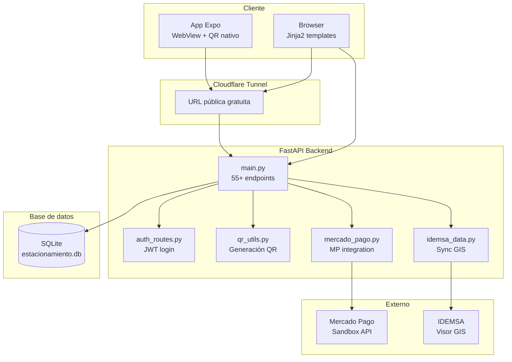
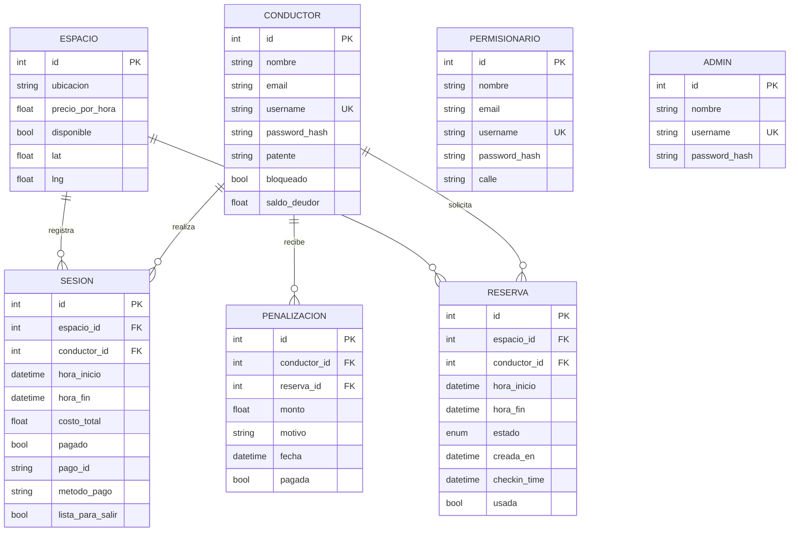
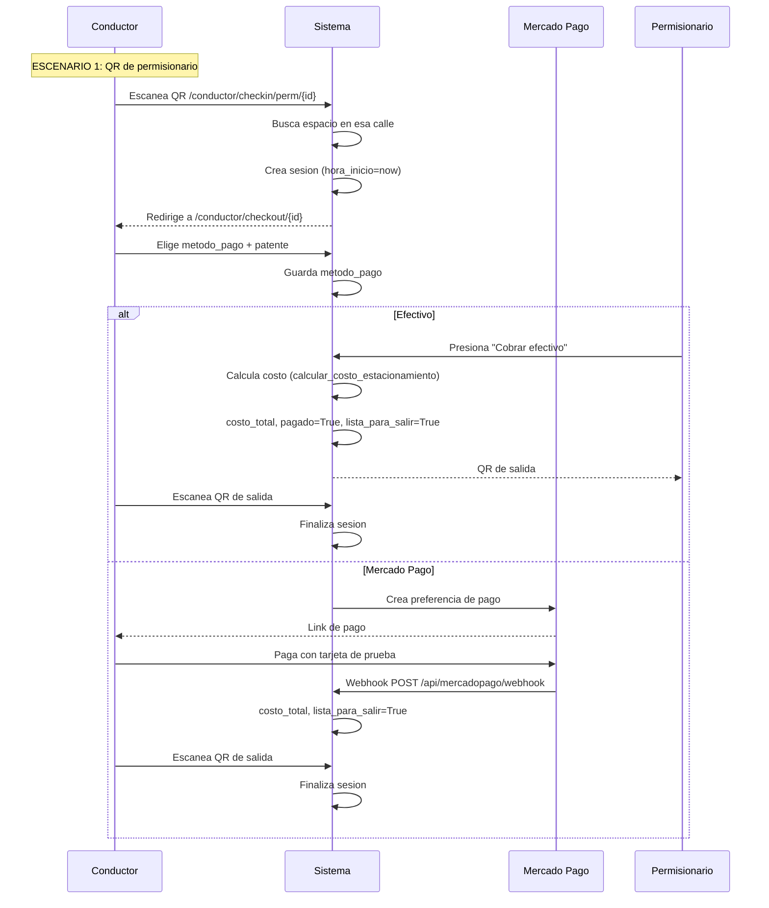
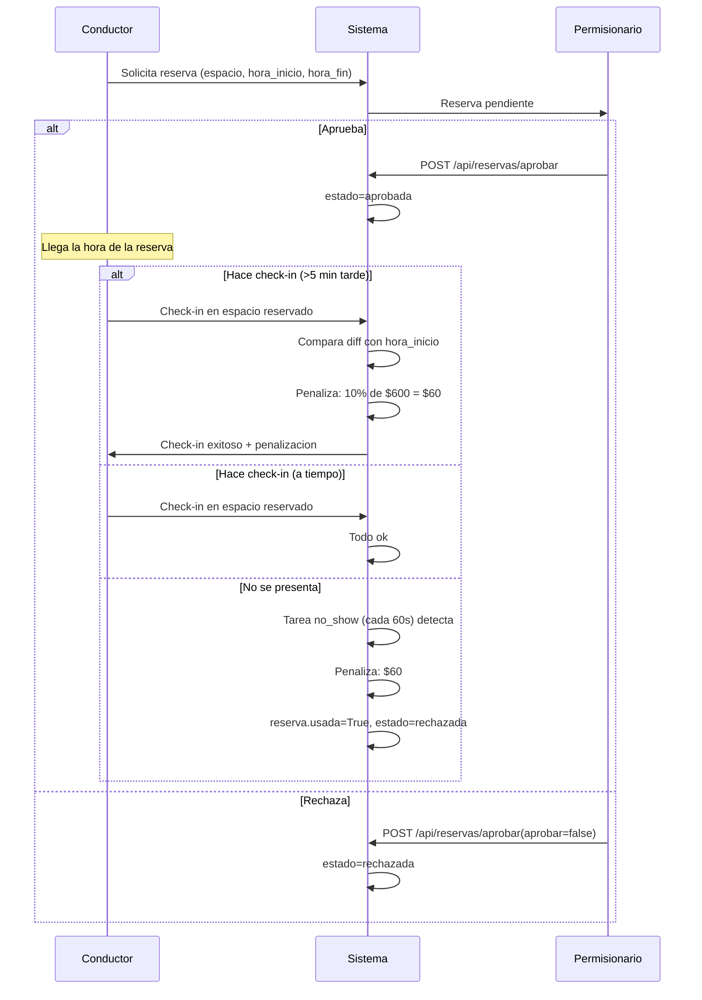
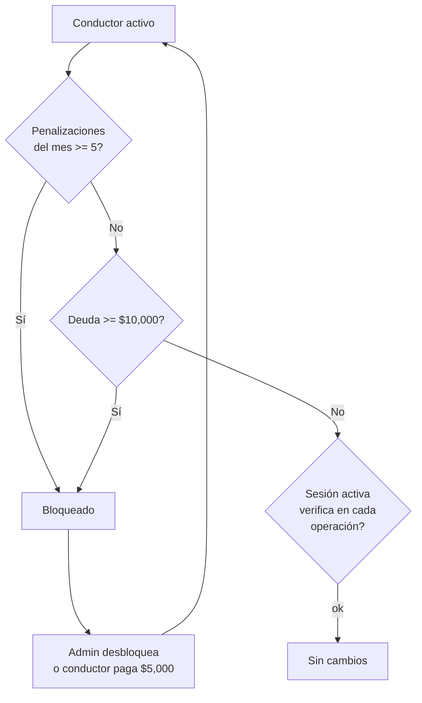
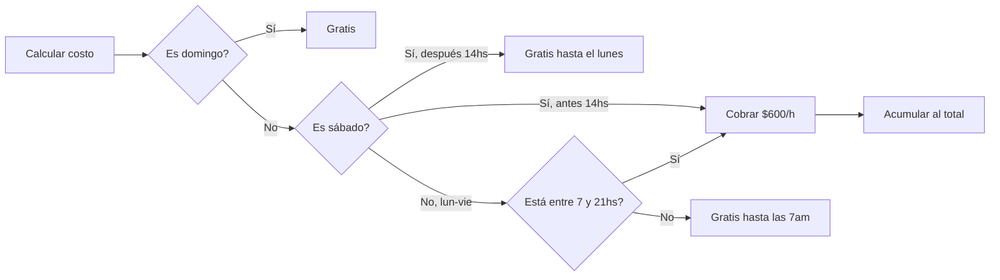

# Arquitectura del sistema

## Diagrama de componentes

## Modelo de datos (ERD)

## Relaciones clave

- **Permisionario ↔ Espacios**: el permisionario NO tiene espacios asignados directamente. Es dueño de una **calle entera**. Los espacios se matchean por `ubicacion.startswith(perm.calle)`.
- **Espacios IDEMSA**: 6,974 espacios generados a partir de 604 segmentos viales oficiales. Grid de ~7m entre puntos.
- **Sesión**: una sesión pertenece a un conductor y un espacio. El costo se calcula al finalizar según `calcular_costo_estacionamiento(inicio, fin)`.

## Flujo de check-in / check-out

## Flujo de reservas y penalizaciones

## Flujo de bloqueo

## Tarifas y horarios

## Stack detallado

| Componente | Tecnología | Versión | Rol |
|------------|-----------|---------|-----|
| Backend | FastAPI | 0.115+ | Servidor ASGI con tipado fuerte |
| ORM | SQLAlchemy | 2.0+ | Async, sesiones por request |
| DB | SQLite | 3.x | Archivo único, sin servidor |
| Auth | python-jose + bcrypt | — | JWT HS256, 24hs expiración |
| QR | qrcode (PIL) | — | Generación server-side |
| Pagos | mercadopago | SDK | Sandbox con webhook |
| Frontend | Jinja2 + CSS | — | Server-rendered, forced dark |
| Mapas | Leaflet | 1.9 | OSM tiles + MarkerCluster |
| Mobile | Expo + WebView | 52 | Web wrapper + QR nativo |
| Tunnel | cloudflared | — | Exposición gratuita |

## Archivos clave

| Archivo | Líneas | Propósito |
|---------|--------|-----------|
| `app/main.py` | 1297 | Rutas API + HTML + lógica de negocio |
| `app/models.py` | 114 | 7 modelos SQLAlchemy |
| `app/schemas.py` | 133 | Schemas Pydantic de entrada/salida |
| `app/idemsa_data.py` | 221 | Sincronización GIS IDEMSA |
| `app/mapa_data.py` | 268 | Calles del centro (mapa offline) |
| `app/auth.py` | 34 | JWT + bcrypt helpers |
| `seed.py` | 67 | Datos de prueba |
