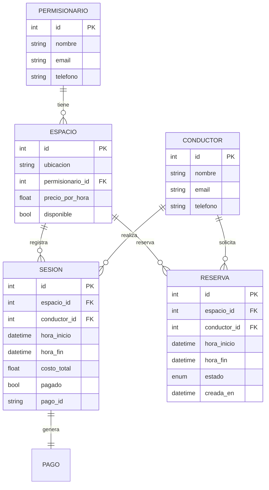
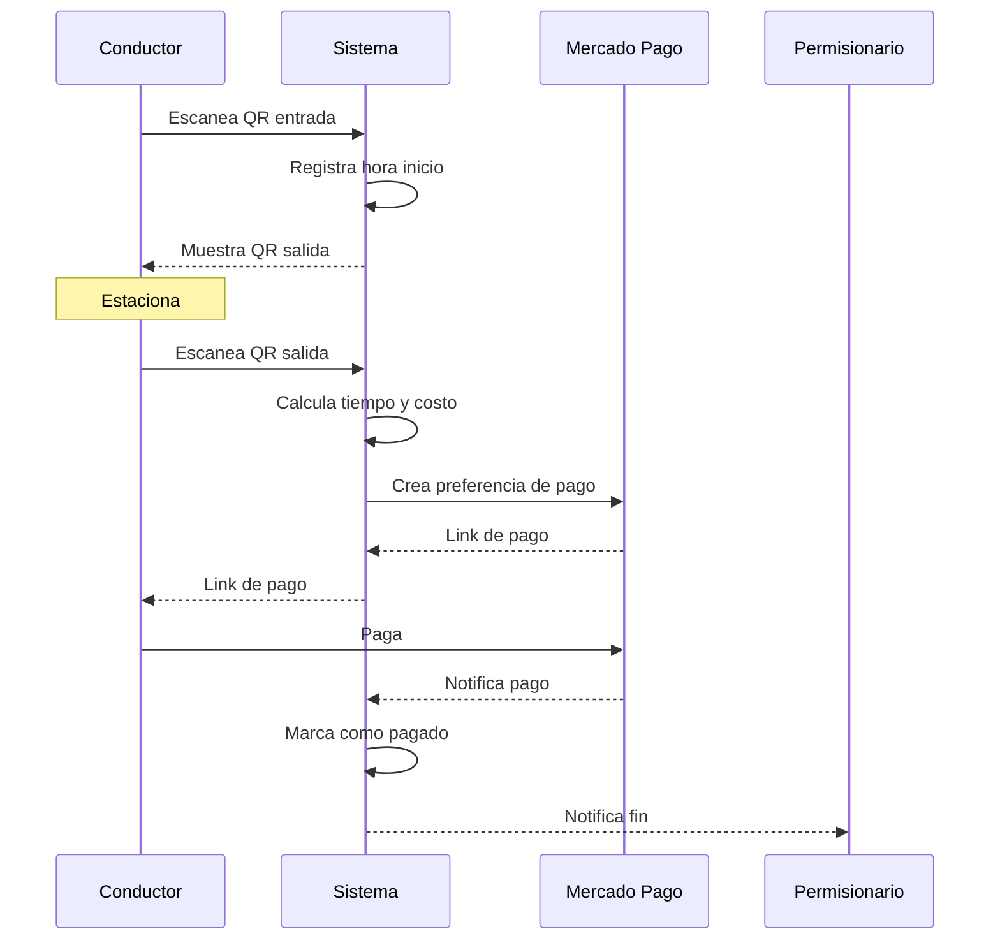

# Arquitectura del sistema

## Diagrama de componentes

```
┌─────────────────────────────────────────────────────────┐
│                      Cliente                             │
│  ┌─────────────┐  ┌──────────┐  ┌──────────────────┐   │
│  │ Expo (app)  │  │ Browser  │  │ Escáner QR       │   │
│  └──────┬──────┘  └────┬─────┘  └────────┬─────────┘   │
└─────────┼──────────────┼─────────────────┼──────────────┘
          │              │                 │
    ┌─────▼──────────────▼─────────────────▼──────┐
    │           Cloudflare Tunnel                  │
    │         (exposición sin hosting)             │
    └────────────────────┬────────────────────────┘
                         │
    ┌────────────────────▼────────────────────────┐
    │              FastAPI (Backend)               │
    │  ┌──────────┐ ┌──────────┐ ┌─────────────┐  │
    │  │   API    │ │  QR Gen  │ │  MP Client  │  │
    │  └────┬─────┘ └──────────┘ └──────┬──────┘  │
    └───────┼───────────────────────────┼──────────┘
            │                           │
    ┌───────▼───────┐           ┌───────▼───────┐
    │    SQLite     │           │ Mercado Pago  │
    │  (base local) │           │ (sandbox API) │
    └───────────────┘           └───────────────┘
```

## Modelo de datos



## Flujo de check-in / check-out



## Stack tecnológico

| Componente   | Tecnología     | Justificación                          |
|-------------|----------------|----------------------------------------|
| Backend     | FastAPI        | Async, tipado, documentación automática|
| Base datos  | SQLite         | Sin servidor, cero config, archivo     |
| QR          | qrcode + PIL   | Generación server-side sin API externa |
| Pagos       | Mercado Pago   | #1 en Argentina, sandbox gratuito      |
| Frontend    | Tailwind + Jinja2 | Sin build step, CDN, responsive     |
| Exposición  | Cloudflare     | Tunnel gratuito, sin dominio propio    |
