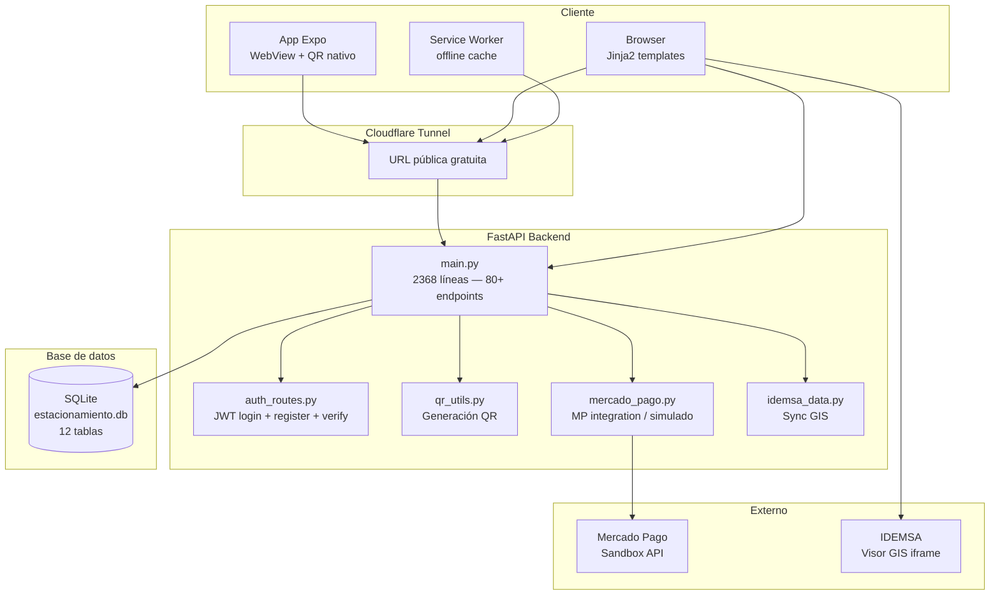
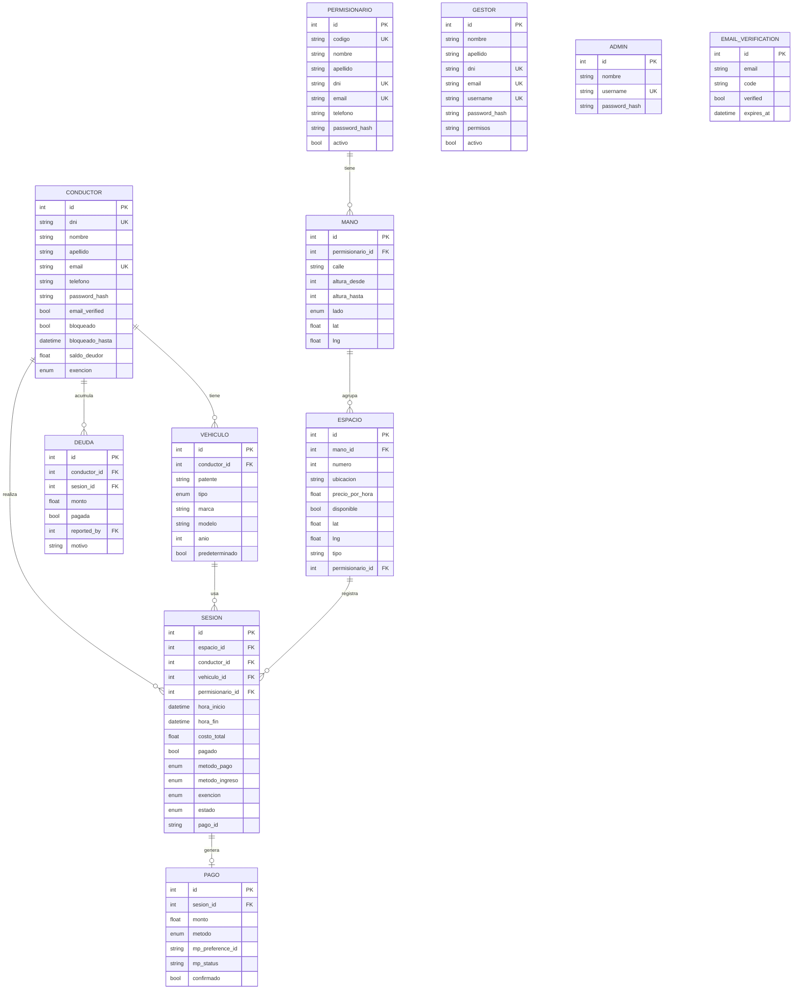
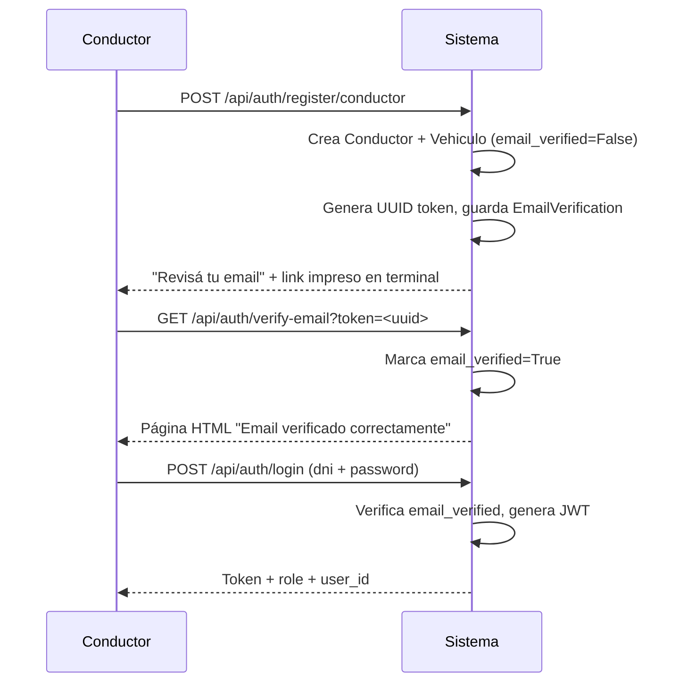
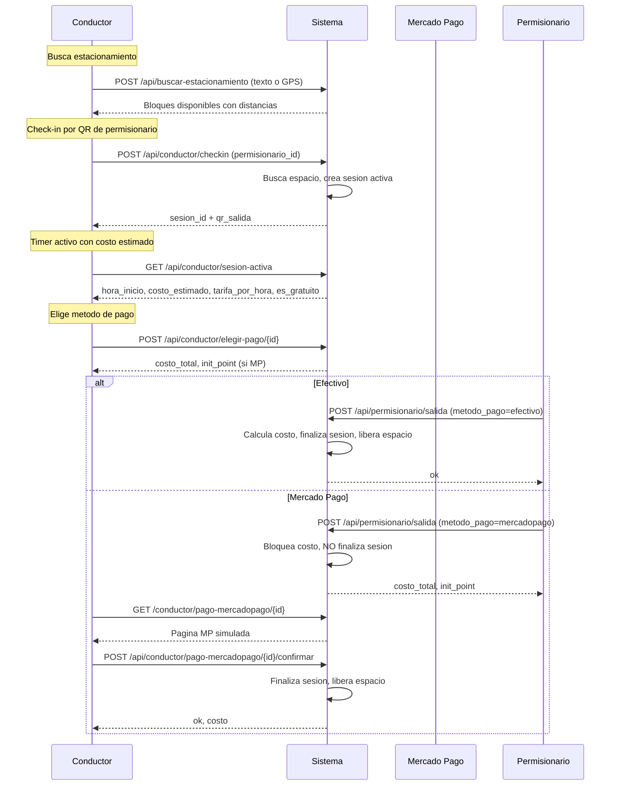
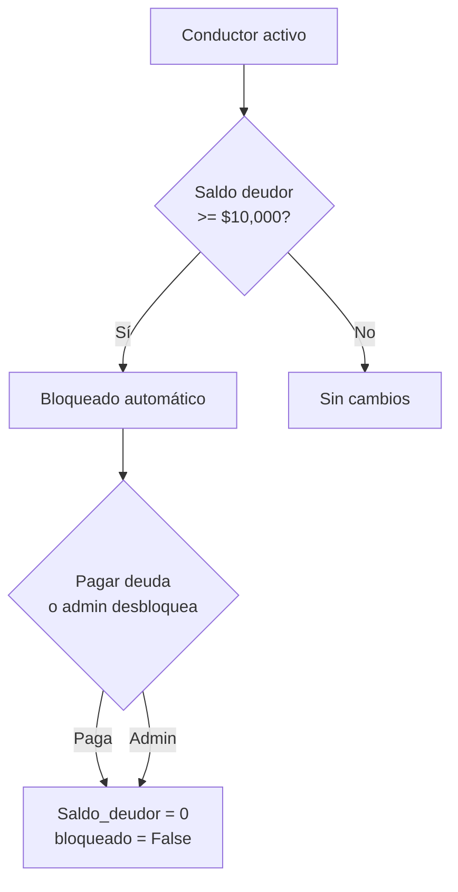
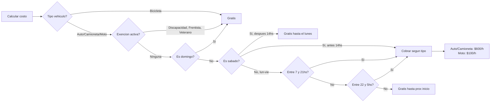

# Arquitectura del sistema

## Diagrama de componentes



## Modelo de datos (ERD)



## Relaciones clave

- **Permisionario ↔ Espacios**: a través de `Mano`. El permisionario tiene una o más manos (calle + rango de altura + lado). Los espacios se filtran por `ubicacion.startswith(mano.calle)` y rango de `numero`.
- **Espacios IDEMSA**: ~6,974 espacios sincronizados desde el visor GIS oficial de IDEMSA. Grid de ~7m entre puntos. Sin distinción par/impar (IDEMSA usa block-level).
- **Sesión**: el costo se calcula en tiempo real según `calcular_costo_estacionamiento(inicio, ahora, tipo, exencion)`.
- **Vehículos compartidos**: no hay validación de dueño — cualquier conductor puede usar cualquier vehículo.

## Flujo de búsqueda de estacionamiento

```mermaid
flowchart TD
    A[Conductor en /buscar] --> B{Como busca?}
    B -->|Texto| C[Ingresa calle + altura<br/>ej: GENERAL GUEMES 150]
    B -->|GPS| D[Presiona Buscar ahora]
    D --> E[Navegador pide ubicacion]
    E --> F[Obtiene lat + lng]
    C --> G[Nominatim geocodifica]
    G --> H[Coordenadas]
    F --> H
    H --> I{Esta en el centro<br/>(<5km del microcentro)?}
    I -->|No| J[Buscador IDEMSA por nombre de calle]
    I -->|Si| K[Busca espacios IDEMSA en radio]
    K --> L[Filtra solo estacionamiento_medido]
    L --> M[Calcula distancia a cada espacio]
    M --> N[Ordena por distancia + top 10]
    N --> O[Agrupa por bloques<br/>calle + altura]
    O --> P[Devuelve bloques con<br/>disponibles y distancia]
    J --> K
```

## Flujo de registro y login



## Flujo del permisionario

```mermaid
flowchart TD
    A[Login PER30456789 / 1234] --> B[Panel principal]
    B --> C{Opcion}
    C -->|Sesiones activas| D[Ver tarjetas con timer+costo]
    D --> E[Tarjeta muestra: patente, tipo, exencion, tarifa, costo estimado]
    E --> F[Ir a Salida]
    F --> G[Seleccionar sesion + metodo pago]
    G --> H{Efectivo o MP?}
    H -->|Efectivo| I[Finaliza sesion inmediato]
    H -->|MP| J[Sesion queda activa con hora_fin + costo bloqueado]
    J --> K[Conductor confirma pago MP]
    K --> L[Finaliza sesion]
    I --> M[Espacio liberado]
    L --> M
    C -->|Ingreso manual| N[Ingresar patente]
    N --> O{Busca vehiculo en DB?}
    O -->|Existe| P[Crea sesion con conductor existente]
    O -->|No existe| Q[Crea conductor guest + vehiculo]
    Q --> P
    C -->|QR| R[Muestra QR de la cuadra]
    R --> S[QR apunta a /estacionar?perm={id}]
    C -->|Cuadra| T[Muestra calles asignadas]
    T --> U[Calle + altura_desde + altura_hasta + lado]
    C -->|Espacios| V[Mapa con espacios coloreados]
    V --> W[Verde = libre, Rojo = ocupado]
```

## Flujo de sincronización IDEMSA

```mermaid
flowchart LR
    A[Inicio servidor] --> B[sync_espacios_db]
    B --> C[Lee archivo JS estacionamiento_mar25.js]
    C --> D[Parsea segmentos viales]
    D --> E[Genera grid de ~7m por segmento]
    E --> F[Calcula altura aprox por interpolacion]
    F --> G[Guarda en DB: ubicacion, lat, lng, tipo, numero]
    G --> H[~6974 espacios en tabla espacios]
    H --> I[Permisionarios filtran por calle + rango altura]
```



## Flujo de check-in / check-out



## Flujo de salida (conductor no finaliza)

```mermaid
flowchart TD
    A[Conductor en checkout] --> B{Metodo de pago?}
    B -->|Efectivo| C[Permisionario procesa salida]
    B -->|Mercado Pago| D[Permisionario procesa salida con MP]
    C --> E[Sesion finalizada<br/>espacio liberado]
    D --> F[Sesion sigue activa<br/>hora_fin y costo bloqueados]
    F --> G[Conductor paga en MP simulado]
    G --> H[POST /api/conductor/pago-mercadopago/{id}/confirmar]
    H --> E
```

## Flujo de bloqueo



## Tarifas y horarios



## Stack detallado

| Componente | Tecnología | Versión | Rol |
|------------|-----------|---------|-----|
| Backend | FastAPI | 0.115+ | Servidor ASGI con tipado fuerte |
| ORM | SQLAlchemy | 2.0+ | Async, sesiones por request |
| DB | SQLite | 3.x | Archivo único, sin servidor |
| Auth | python-jose + bcrypt | — | JWT HS256, 24hs expiración |
| QR | qrcode (PIL) | — | Generación server-side |
| Pagos | mercadopago SDK | — | Sandbox con fallback simulado |
| Frontend | Jinja2 + CSS | — | Server-rendered, mobile-first |
| Mapas | IDEMSA iframe + Leaflet | — | Embed GIS + capas offline |
| PWA | Service Worker | — | Cache-first static, network-first API |
| Mobile | Expo + WebView | 52 | Web wrapper + QR nativo |
| Tunnel | cloudflared | — | Exposición gratuita |

## Archivos clave

| Archivo | Líneas | Propósito |
|---------|--------|-----------|
| `app/main.py` | 2368 | Rutas API + HTML + lógica de negocio |
| `app/models.py` | 238 | 10 modelos SQLAlchemy |
| `app/schemas.py` | — | Schemas Pydantic de entrada/salida |
| `app/idemsa_data.py` | — | Sincronización GIS IDEMSA |
| `app/auth_routes.py` | 144 | Login + registro + verificación email |
| `auth.py` | 34 | JWT + bcrypt helpers |
| `seed.py` | 147 | Datos de prueba |
